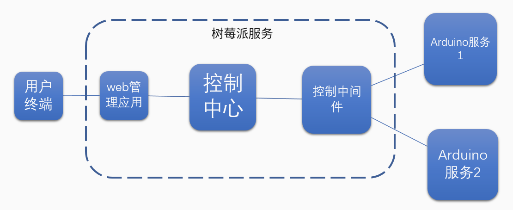

# 智能宿舍解决方案

2017级1班 成子谦

## 引言

乘着5G时代的东风，“物联网”三个字逐渐走进公众视野，并以不同的形式影响着人们生活的方方面面。然而物联网本身并不是什么新鲜事物，它的起源最早可以追溯到1985年，Peter.T.Lewis率先提出了这一概念。1995年，Bill Gates在*The Road Ahead*中提及到物联网的概念$^{[1]}$ ，只是当时受制于无线网络、硬件和传感设备的发展，未能引起世人的重视。1999年，美国Auto-ID首先提出“物联网”的概念$^{[2]}$，主要是建立在物品编码、RFID技术和互联网的基础上。在当时的中国，物联网被称为“传感网”。中科院早在1999年就启动了传感网的研究，取得了一些科研成果，并建立了一些适用的传感网。同年，在美国召开的移动计算和网络国际会议提出“传感网是下一个世纪人类面临的又一个发展机遇”。2005年11月17日，世界信息峰会上，国际电信联盟发布了《ITU互联网报告2005：物联网》，其中指出“物联网”时代的来临$^{[2]}$。

物联网的实现需要给每个物体分配唯一的标识或地址，最早的可定址性想法是基于RFID标签和电子产品唯一编码来实现的。另一个想法$^{[3]}$是用现有的命名协议，如统一资源标志符来访问所有物品。这些物品本身不能交谈，但通过这种方式它们可以被其他节点访问。

下一代互联网将使用IPv6协议，它拥有极大数量的地址资源，使用IPv6的程序能够和几乎所有接入设备进行通信。这个系统将能够识别任何一种物品。

物联网系统很可能是一个事件驱动的架构，自底向上进行构建，并囊括各种子系统。因此，模型驱动和功能驱动的方式将会共存，系统能够较容易地加入新的节点，并能够处理意外。在物联网中，一个时间信息很可能不是一个预先被决定给定，有确定句法结构的消息，而是一种能够自我表达的内容。相应地，信息也不必要有着确定的协议来规范所有可能的内容，因为不可能存在一个“终极的规范”能够预测所有的信息内容。那种自上而下进行的标准化是静态的，无法适应网络动态的演化，因而也是不切实际的。在物联网上的信息应该是能够自我解释的，顺应一些标准，同时也能够演化的。

物联网的核心和基础仍将是互联网，但互联网需要一系列技术升级才能满足物联网的需求，而5G通信技术的出现大大推进了物联网发展的进度。

5G是最新一代蜂窝移动通信技术，它的性能目标是高数据速率、减少延迟、节省能源、降低成本、提高系统容量和大规模设备连接。与早期的2G、3G和4G网络相比，5G的服务区域被划分为许多被称为蜂窝的小地理区域。表示声音和图像的模拟信号在手机中被数字化，由模数处理器转换并作为比特流传输。蜂窝中的所有5G无线设备通过无线电波与蜂窝中的本地天线阵和低功率自动收发器(发射机和接收机)进行通信。收发器从公共频率池分配频道，这些频道在地理上分离的蜂窝中可以重复使用。本地天线通过高带宽光纤或无线回程连接与电话网络和互联网连接。与现有的手机一样，当用户从一个蜂窝移动到另一个蜂窝时，他们的移动设备将自动切换到新蜂窝的频道。

5G网络的主要优势在于，数据传输速率远远高于以前的蜂窝网络，最高可达10 Gbit/s，比当前的有线互联网要快，比先前的4G LTE蜂窝网络快100倍。另一个优点是较低的网络延迟，低于1毫秒，而4G为30-70毫秒。由于数据传输更快，5G网络将不仅仅为手机提供服务，而且还将成为一般性的家庭和办公网络提供商，与有线网络提供商竞争。以前的蜂窝网络提供了适用于手机的低数据率互联网接入，但是一个手机发射塔不能经济地提供足够的带宽作为家用电脑的一般互联网供应商。

目前，中国对5G通信技术的发展呈大力支持的积极态度。2017年11月15日，工信部发布《关于第五代移动通信系统使用3300-3600MHz和4800-5000MHz频段相关事宜的通知》，确定5G中频频谱，能够兼顾系统覆盖和大容量的基本需求。11月下旬，工信部发布通知，正式启动5G技术研发试验第三阶段工作，并力争2018年年底前实现第三阶段试验基本目标。2018年12月7日，工信部同意联通集团自通知日至2020年6月30日使用3500MHz-3600MHz频率，用于在全国开展第五代移动通信系统试验。12月10日，工信部正式对外公布，已向中国电信、中国移动、中国联通发放了5G系统中低频段试验频率使用许可。这意味着各基础电信运营企业开展5G系统试验所必须使用的频率资源得到保障，向产业界发出了明确信号，进一步推动我国5G产业链的成熟与发展。2019年6月6日，工信部正式向中国电信、中国移动、中国联通、中国广电发放5G商用牌照，中国正式进入5G商用元年。

在互联网通信技术飞速发展的背景下，物联网展现了更加旺盛的生命力，进一步向前发展。

## 相关工作

物联网在人类生活中有许许多多展现形式，而智能家居是其与人交互的主要手段之一。智能家居是在互联网影响之下物联化的体现。智能家居通过物联网技术将家中的各种设备连接到一起，提供家电控制、照明控制、电话远程控制、室内外遥控、防盗报警、环境监测、暖通控制、红外转发以及可编程定时控制等多种功能和手段。与普通家居相比，智能家居不仅具有传统的居住功能，兼备建筑、网络通信、信息家电、设备自动化，提供全方位的信息交互功能，甚至为各种能源费用节约资金。

智能家居的概念起源很早，但一直未有具体的建筑案例出现，直到1984年美国联合科技公司（United Technologies Building System）将建筑设备信息化、整合化概念应用于美国康涅狄格州哈特佛市的CityPlaceBuilding时，才出现了首栋的“智能型建筑”，从此揭开了全世界争相建造智能家居的序幕。

根据智能家居的主要使用场景及其功能，可以分为以下四类：

1. 家庭自动化

   家庭自动化系指利用微处理电子技术，来集成或控制家中的电子电器产品或系统。家庭自动化系统主要是以一个中央微处理机接收来自相关电子电器产品的讯息后，再以既定的程序发送适当的信息给其它电子电器产品。家庭自动化是智能家居的一个重要系统，在智能家居刚出现时，家庭自动化甚至就等同于智能家居，它仍是智能家居的核心之一，但随着网络技术有智能家居的普遍应用，网络家电/信息家电的成熟，家庭自动化的许多产品功能将融入到这些新产品中去，从而使单纯的家庭自动化产品在系统设计中越来越少，其核心地位也将被家庭网络/家庭信息系统所代替。它将作为家庭网络中的控制网络部份在智能家居中发挥作用。

2. 家庭网络

   首先要把这个家庭网络和纯粹的“家庭局域网”分开来，它是指连接家庭里的个人计算机、各种外设及与因特网互联的网络系统，它只是家庭网络的一个组成部份。家庭网络是在家庭范围内将PC、家电、安全系统、照明系统和广域网相连接的一种新技术。 当前在家庭网络所采用的连接技术可以分为“有线”和“无线”两大类。家庭网络相比起传统的办公网络来说，加入了很多家庭应用产品和系统，如家电设备、照明系统，因此相应技术标准也错综复杂。

3. 网络家电

   网络家电是将普通家用电器利用数字技术、网络技术及智能控制技术设计改进的新型家电产品。网络家电可以实现互联组成一个家庭内部网络，同时这个家庭网络又可以与外部互联网相连接。可见，网络家电技术包括两个层面：首先就是家电之间的互连问题，也就是使不同家电之间能够互相识别，协同工作。第二个层面是解决家电网络与外部网络的通信，使家庭中的家电网络真正成为外部网络的延伸。

4. 信息家电

   信息家电应该是一种价格低廉、操作简便、 实用性强、带有个人计算机主要功能的家电产品。利用电脑、电信和电子技术与传统家电相结合的创新产品， 是为数字化与网络技术更广泛地深入家庭生活而设计的新型家用电器，信息家电包括计算机、机顶盒、HPC、超级VCD、无线数据通信设备、网络电视、网络电话等等，所有能够通过网络系统交互信息的家电产品，都可以称之为信息家电。音频、视频和通信设备是信息家电的主要组成部分。另一方面, 在传统家电的基础上，将信息技术融入传统的家电当中，使其功能更加强大，使用更加简单、方便和实用，为家庭生活创造更高品质的生活环境。比如模拟电视发展成数字电视，VCD变成DVD，电冰箱、洗衣机、微波炉等也将会变成数字化、网络化、智能化的信息家电。

   从广义的分类来看，信息家电产品实际上包含了网络家电产品，但如果从狭义的定义来界定，我们可以这样做一简单分类：信息家电更多的指带有嵌入式处理器的小型家用信息设备，它的基本特征是与网络相连而有一些具体功能，可以是成套产品，也可以是一个辅助配件。而网络家电则指一个具有网络操作功能的家电类产品，这种家电可以理解是我们原来普通家电产品的升级。

智能家居网络随着集成技术、通信技术、互操作能力和布线标准的实现而不断改进。它设计对家庭网络内所有的智能家具、设备和系统的操作、管理以及集成技术的应用。其技术特点表现如下：

1. 通过家庭网关及其系统软件建立智能家居平台系统

   家庭网关是智能家居局域网的核心部分，主要完成家庭内部网络各种不同通信协议之间的转换和信息共享，以及与外部通信网络之间的数据交换功能，同时网关还负责家庭智能设备的管理和控制。

2. 统一平台

   用计算机技术、微电子技术、通信技术，家庭智能终端将家庭智能化的所有功能集成起来，使智能家居建立在一个统一的平台之上。首先，实现家庭内部网络与外部网络之间的数据交互；其次，还要保证能够识别通过网络传输的指令是合法的指令，而不是黑客的非法入侵。

3. 通过外部扩展模块实现与家电的互联

   为实现家用电器的集中控制和远程控制功能，家庭智能网关通过有线或无线的方式，按照特定的通信协议，借助外部扩展模块控制家电或照明设备。

4. 嵌入式系统的应用

   以往的家庭智能终端绝大多数是由单片机控制的。随着新功能的增加和性能的提升，将处理能力大大增强的具有网络功能的嵌入式操作系统和单片机的控制软件程序做了相应的调整，使之有机地结合成完整的嵌入式系统。

智能家居作为一个新生产业，处于一个导入期与成长期的临界点，市场消费观念还未形成，但随着智能家居市场推广普及的进一步落实，培育起消费者的使用习惯，智能家居市场的消费潜力必然是巨大的，产业前景光明。智能家居在中国的发展经历的五个阶段如下：

1. 萌芽期（1994年-1999年）

   这是智能家居第一个发展阶段，整个行业还处在一个概念熟悉、产品认知的阶段，这时没有出现专业的智能家居生产厂商，只有深圳有一两家从事美国X-10智能家居代理销售的公司从事进口零售业务，产品多销售给居住国内的欧美用户。

2. 开创期（2000年-2005年）

   这段时间，国内先后成立了五十多家智能家居研发生产企业，主要集中在深圳、上海、天津、北京、杭州、厦门等地。智能家居的市场营销、技术培训体系逐渐完善起来，此阶段，国外智能家居产品基本没有进入国内市场。

3. 徘徊期（2006年-2010年）

   2005年以后，由于上一阶段智能家居企业的野蛮成长和恶性竞争，给智能家居行业带来了极大的负面影响：包括过分夸大智能家居的功能而实际上无法达到这个效果、厂商只顾发展代理商却忽略了对代理商的培训和扶持导致代理商经营困难、产品不稳定导致用户高投诉率。行业用户、媒体开始质疑智能家居的实际效果，由原来的鼓吹变得谨慎，市场销售也几年出来增长减缓甚至部分区域出现了销售额下降的现象。在2005年到2007年这段时间，大约有20多家智能家居生产企业退出了这一市场，各地代理商结业转行的也不在少数。许多坚持下来的智能家居企业，在这几年也经历了缩减规模的痛苦。正在这一时期，国外的智能家居品牌却暗中布局进入了中国市场，而活跃在市场上的国外主要智能家居品牌都是这一时期进入中国市场。

4. 融合演变期（2011年-2020年）

   2011年以来，市场明显看到了增长的势头，而且大的行业背景是房地产受到调控。智能家居的放量增长说明智能家居行业进入了一个拐点，由徘徊期进入了新一轮的融合演变期。接下来的三到五年，智能家居一方面进入一个相对快速的发展阶段，另一方面协议与技术标准开始主动互通和融合，行业并购现象开始出来甚至成为主流。

5. 爆发期（2021年-未来）

   各大厂商已开始密集布局智能家居，尽管从产业来看，还没有特别成功、特别能代表整个行业的案例显现，这预示着行业发展仍处于探索阶段，但越来越多的厂商开始介入和参与已使得外界意识到，智能家居未来已不可逆转，智能家居企业如何发展自身优势和其他领域的资源整合，成为企业乃至行业的“站稳”要素。

现在，全行业正逐渐从融合演变期走向爆发期，市场上已经有大量的智能家具产品出现。从流行大众的单品“爆款”（如小米公司的“小爱同学”，阿里巴巴的“天猫精灵”）到配套齐全的解决方案（如苹果公司、索尼公司、华为公司分别推出的智能家居套件），无一不各有特点、发展全面、竞争激烈，且它们都具有良好的外观设计、稳定可靠的服务、舒适的交互体验，能很好地融入人类的生活中、与人和谐自然地沟通。有理由作出这样的预计：未来的5到10年内，家具产品将在保持基本功能的完整性下，逐渐往易用性、互操作性发展；智能家具将会逐步完善其功能，相关行业将具备完整的产业链开发能力，其发展前途具有巨大的潜力。

## 研究内容

（研究一个针对小场景的，具有高可用性、可修改性和可测试性的智能家居解决方案）

目前，市场上已存在大量智能家居产品。研究小组成员通过产品官网和不同的电商平台，总结出市场上已有产品的特征如下：

- 可用性
- 稳定性
- 互操作性

这样的产品能满足大部分场景的需要，也具备一定的可操控性。然而对于部分空间狭小、需要进行高度定制化的场景而言，大部分产品由于其集成化程度高，导致其可修改性不佳、可定制化能力不足，从而不能很好地根据实际场景而改变其部署方式。研究小组希望在保持智能家居可用性的前提下，探究并建立一个针对小场景的，具有高可用性、可修改性和可测试性的智能家居解决方案。

由于受场景、资金和时间限制，我们围绕“学校学生宿舍”这一基础场景开展研究，设计并实现了多个demo，取得了一些阶段性的成果。

## 技术路线

（如何架构整个项目，每个环节用什么技术去实现）

研究小组经过商讨，决定本解决方案采用B/S架构实现。通过把具体服务部署到具体硬件上，把服务器部署到服务器上，并通过网络信道实现服务器与具体硬件的沟通。

解决方案架构图如图一所示。

解决方案架构呈星形，从控制中心出发往两边延伸。一方面，控制中心通过web管理应用与用户进行交互，通过web管理应用接收并执行用户的请求，并返回所需数据；另一方面，控制中心通过控制中间件与具体硬件进行通信，从硬件中获取所需信息，并执行用户请求的命令。从云服务的角度看，整个解决方案采取了SaaS的模式来实现，这也符合B/S架构的定位。

## 实验

（简单阐述一下如何设计实验，以及介绍接下来arduino的工作）

在进行具体实验之前，研究小组针对研究目标，开展了需求分析、购置用品、demo开发、单元测试、集成测试等工作。

### 需求分析

根据宿舍这一具体场景，研究小组经过分析，提出了以下三点需求，并逐一实例化，完成了demo的制作：

- 智能灯控
- 自动浇水
- 久坐提醒

### 实验配置

（硬件配置、包括arduino开发板、传感器等）

实验所需硬件：

- Raspberry Pi 3B+开发板，一块
- Raspberry Pi 3B+开发板配套电源，一套
- SanDisk 32G TF卡，一张
- WiFi路由器，一个
- Arduino Uno R3开发板，两块
- 蜂鸣器，两个
- DHT11温湿度传感器，一个
- ESP8266 WiFi模块，两个
- HC-SR501人体检测传感器，一个
- HW-069四位数码管，一个
- LCD1602屏幕，一个
- MSQC6412C四位数码管，一个
- 面包板，两个
- 公对公、母对母、公对母线，各20根

实验所需

### Demo开发

三个demo，智能灯控、自动浇水、久坐提醒

### 单元测试

### 集成测试

## 结论

我的队友nb

## 参考文献

好多，一堆官网，新闻，芯片手册等等

## 附录

ppt和代码